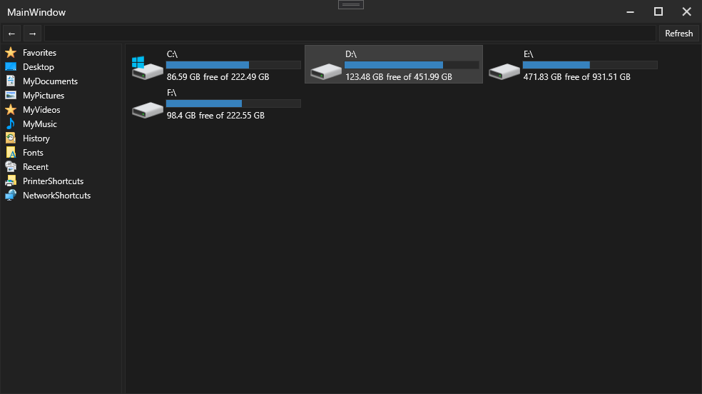
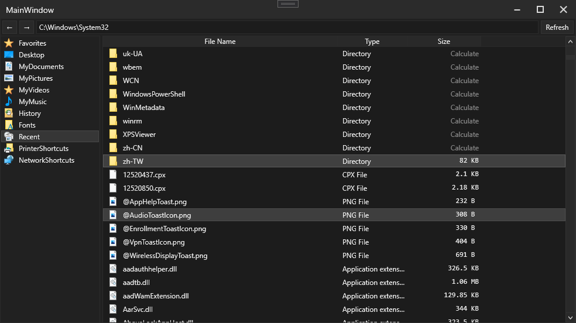

# RZFileExplorer
A file explorer made in WPF, using MVVM

A list of todos at the bottom :)

## Previews

## Todo:
- Add a rectangular selector, like the original file explorer
- Add the ability to create/remove folders and files, and also rename folders and files too
- Show drive's Format type and volume label (not just the path)
- Add automatic refreshing when the window is focused, or maybe use the built in file listeners to listen to changes to the current directory
- Add multi-tab support, so that you don't need multiple windows open (duh)
- Add option to change theme
- Add a hide button to the rectangle at the top
- Add some controls to that rectangle at the top (add/remove/cut/paste/pin to quick access/etc)
- Add context menu to file items (e.g to open as, or show properties)
- Add multi-select support to file items (doable with IoC and something like IMultiSelectListBox that the main window define to wrap around ListBox)
- Convert to a core and windows project... optional though
- Add search feature
- Somehow generate thumbnails for images, unless windows can do it for us (via pinvoke maybe)
- Add new view modes to the lists, e.g a zoomable wrap panel instead of the normal stack panel
- Add feature to resolve the target path of .lnk files (aka shortcuts) and navigate to shortcut folders
- Better support for opening files, instead of just Process.Start()? Somehow find out how explorer does it, maybe via pinvoke and ShellExecute?
- Figure out how to set current directory when opening files, e.g opening C:\Windows\System32\cmd.exe in file explorer defaults CMD to the System32 folder, but mine defaults to the project debug or release folder
- Add closeable details pane and preview pane
- Add better navigation bar (aka the thing where you can type in a path to navigate to it). file explorer can switch between the custom thing and a textbox
